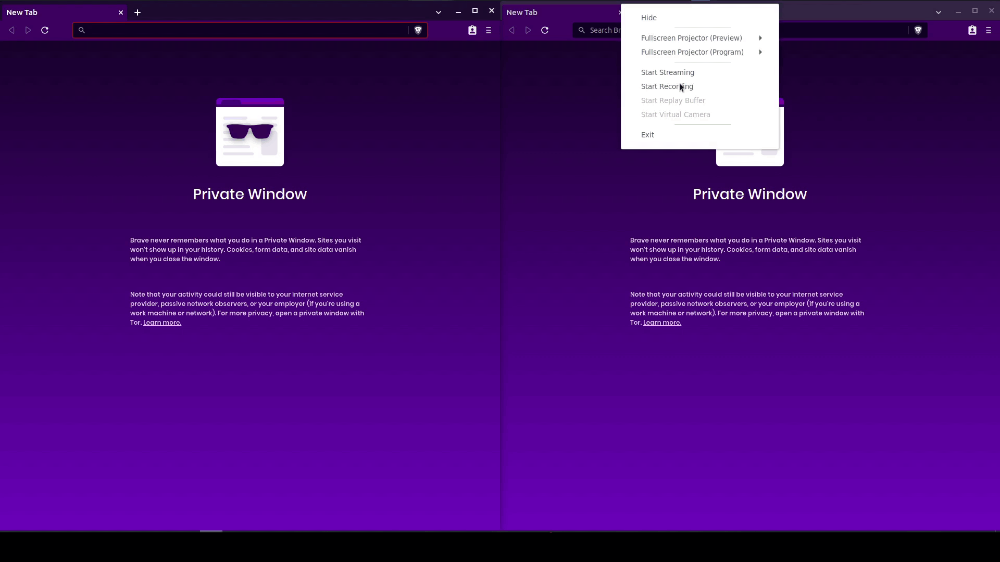

<p align="center">
  
  <h3 align="center">SSE Demo</h3>
  <p align="center"> server-sent-event demo in nodejs </p>
</p>


### screenshot
<p align="center">
  
  
</p>

### Usage

1. Clone the repo

   ```sh
   git clone https://github.com/civilcoder55/sse-demo.git
   ```
2. Change directory

   ```sh
    cd sse-demo
   ```

3. Install npm packages

   ```sh
   npm install
   ```

4. run server

   ```sh
   node server.js
   ```

5. go to
   ```sh
   http://127.0.0.1:3000/
   ```
